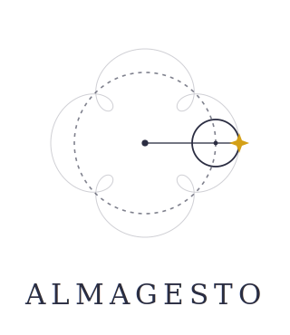
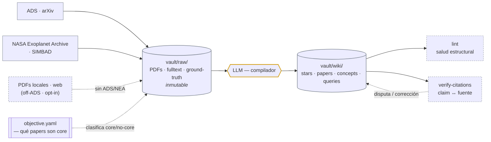

<p align="center">
  
</p>

# Almagesto — template de wiki de conocimiento astro (patrón LLM Wiki)

[](https://github.com/nicklessagus/Almagesto/actions/workflows/ci.yml)
[](https://github.com/nicklessagus/Almagesto/tags)
[](LICENSE)
[](https://github.com/nicklessagus/Almagesto/generate)

Base de conocimiento mantenida por un LLM (patrón [LLM Wiki](vault/raw/refs/karpathy-llm-wiki.md) de
Karpathy) sobre **literatura astronómica**, organizada por **estrella** y por **concepto**. Reúne todo
lo publicado relevante (planetas, actividad, indicadores, métodos), en formato a la vez **legible**
(notas + grafo Obsidian + síntesis de huecos) y **máquina-legible** (frontmatter YAML que puede
consumir un agente o humano para armar código, un informe o un paper — siempre arrastrando las citas
`[[bibcode]]` correspondientes).

Es un **template**: el objetivo de cada bóveda (de qué trata, **qué papers son "core"**) se setea en
un solo archivo, `vault/config/objective.yaml`. El resto del repo es framework reusable:
**`vault/raw/`** (fuentes inmutables: PDFs, fulltext, ground-truth de NASA Exoplanet Archive) →
**LLM** (compilador) → **`vault/wiki/`** (fichas que el LLM escribe y mantiene), con un `lint` de
salud estructural y una capa de **verificación claim↔fuente**. El schema con el que opera el agente
está en [`CLAUDE.md`](CLAUDE.md).



> Por defecto la bibliografía entra por **ADS** (plomería astro). El **modo off-ADS** (opt-in, sólo a
> pedido) es para los **métodos que no son exclusivamente astronómicos** —análisis de datos, machine
> learning, procesos gaussianos, signal processing— cuya bibliografía canónica vive **fuera de ADS**: se
> declara en `topics.yaml` con `source: web \| local-pdfs` + su lista `sources:` y entra a `vault/raw/`
> desde snapshots web + PDFs locales, sin ADS/NEA. Sigue rigiendo la **frontera dura**: sólo bibliografía
> citable — el método **publicado**, no su implementación.

## Instanciar (crear tu bóveda)

**Recomendado — botón "Use this template":** en la [página del repo](https://github.com/nicklessagus/Almagesto)
apretá **"Use this template" → Create a new repository**. GitHub te crea un repo **propio** con esta
estructura e historia limpia. Después cloná *tu* repo nuevo y configurálo:

```bash
git clone git@github.com:TU_USUARIO/mi-boveda.git && cd mi-boveda
git config core.hooksPath scripts/hooks     # (opcional) pre-commit que corre el lint
git lfs install                             # PDFs por git-lfs
git config merge.ours.driver true           # protege tus archivos de instancia en futuros merges
git remote add upstream https://github.com/nicklessagus/Almagesto.git  # de acá traés mejoras del framework
pip install -r requirements.txt
echo "TU_TOKEN" > vault/config/ads_dev_key  # token ADS (gratis, gitignored)
```

> Dependencias del sistema (`pdftotext`, git-lfs; opcionales OCR y curl), la alternativa por `git
> clone` directo y el detalle por OS: ver [`docs/operacion.md`](docs/operacion.md). El token ADS es
> gratis en <https://ui.adsabs.harvard.edu/user/settings/token>.

Después **definí el objetivo pidiéndoselo al agente** — no hace falta escribir YAML ni regex a mano. El
skill `setup` traduce tu foco (en palabras) a `relevance.topics` (los buckets que deciden qué paper es
*core*), lo **prueba contra ADS** y te muestra el corte para que lo apruebes:

> **Vos:** *"configurá la bóveda: quiero separar actividad estelar de señales planetarias en RV."*
>
> **Agente (skill `setup`):** arma los buckets (`rv`, `activity`, `method`…) y corre el preview
> (`query_ads.py --probe`, no baja nada):
> ```
> 41/50 CORE · top por citas  [CORE/—  · tópicos que matchearon]:
> [CORE]  812  Stellar activity and radial-velocity jitter in...    «rv,activity»
> [CORE]  333  Gaussian-process modelling to disentangle planets...  «rv,activity,method»
> [—   ]  210  A catalogue of nearby M dwarfs                        «(ninguno)»
> ```
> Afina la regex e itera hasta que el corte cierre → te deja `vault/config/objective.yaml` listo.

Con el objetivo definido, sumás estrellas/temas y los ingestás, también pidiéndoselo al agente:
*"bajá HD 152391"* (`ingest-star`) o *"investigá BSS sobre RV"* (`ingest-topic`).

## De un objetivo a una ficha (qué hace un ingest)

Cuando le pedís ingestar una estrella o un tema, el agente:

1. **Busca en ADS** (por estrella: nombre + alias; por tema: keywords) y **clasifica** cada paper con tu
   `relevance.topics`: **core** = matchea ≥1 faceta y no es ruido; el resto queda **no-core**.
2. Los **core** se bajan (PDF + fulltext) y el LLM los **lee y destila** en la ficha: métodos, P/K/e,
   indicadores y por qué es relevante — cada dato con su cita `[[bibcode]]` (trazable hasta el PDF).
3. Los **no-core** no se bajan: quedan sólo listados (top por citas, con link a ADS) en un apéndice
   *"excluidos, por las dudas"* — por si alguno debería haber entrado.

El resultado es una **ficha autosuficiente** (resumen + tablas auto + huecos) que se entiende **sin abrir
ningún paper**, con todo lo que afirma trazable a su fuente.

## Skills del agente (`.claude/skills/`)

Las operaciones del patrón están empaquetadas como skills invocables (Claude las dispara solo por la
descripción, o el usuario con `/<nombre>`). Encapsulan la cadena mecánica + el criterio LLM:

| Skill | Cuándo | Qué hace |
|---|---|---|
| `setup` | "configurá la bóveda", "definí el objetivo" | Paso 0: traduce tu foco en palabras a `objective.yaml` (incluida la regex `relevance.topics`) y la **afina contra ADS con un preview** (`query_ads --probe`), para que NO escribas regex a mano. No ingesta. |
| `ingest-star` | "bajá/ingestá/agregá la estrella X" | Corre la cadena mecánica (orquestador `ingest_star.py`) y hace la extracción LLM de los papers clave + síntesis + bookkeeping. |
| `ingest-topic` | "investigá a fondo el tema X" | Como ingest-star pero por TEMA: query ADS por keywords → concept durable en `concepts/`. Soporta temas off-ADS (opt-in) vía `source: web\|local-pdfs` + `sources:` en `topics.yaml`. |
| `append-knowledge` | "agregale este paper a la ficha X", "sumá este PDF al concept Y" | Pliega **una fuente puntual** (bibcode / PDF / URL) a una ficha/concepto **existente**: plomería mínima + extracción enfocada + síntesis a la nota viva. No crea entidades ni barre por query. |
| `test-hypothesis` | "hipótesis: …", "evidencia a favor/contra de …" | Testea un supuesto **durable** contra el fulltext y responde con veredicto citado; **a pedido del usuario** lo archiva en `concepts/hypotheses/` y taggea papers (`thesis_links`/`bearing`). |
| `query-corpus` | búsqueda/pregunta general (no hipótesis) | Responde contra índice + frontmatter + fulltext; archiva en `vault/wiki/queries/` **sólo si el usuario lo pide**. |
| `verify-citations` | cierre de toda operación con prosa `[[bibcode]]` | Chequea, afirmación por afirmación, que la fuente respalde el claim (1 subagente/par lee el fulltext). |
| `find-contradictions` | "buscá contradicciones", "¿qué papers discrepan sobre X?" | Barre un eje (estrella/parámetro o concepto) y confirma desacuerdos claim↔claim **entre** papers → propone `disputes[]` para que apruebes. |
| `maintain` | "actualizá X", "borrá el paper Y", "renombrá el slug", "re-clasificá" | Mantiene entidades **ya ingestadas**: refrescar con papers nuevos, borrar/renombrar limpio, re-clasificar tras cambiar `relevance.topics`, resolver backlog del lint. |

## Verify — todo claim tiene fuente

El diferencial sobre el patrón base: el lint de Karpathy chequea salud estructural, no que la fuente
**respalde** la afirmación. Acá toda afirmación va citada `[[bibcode]]` o marcada `inferencia`, y el
skill `verify-citations` la contrasta contra el texto real del paper (un subagente por par, con cita
textual obligatoria; una contradicción se convierte en disputa tagueada, no en cita rota). La tasa de
error del verificador se mide con un auto-benchmark que siembra citas falsas y las juzga a ciegas.

## Para seguir

- **Operación día a día** — dependencias completas, layout del repo, scripts sueltos, traer mejoras
  del framework (`upstream`/`merge=ours`), portabilidad entre máquinas, Obsidian:
  [`docs/operacion.md`](docs/operacion.md)
- **Schema del agente** (frontmatter, reglas, operaciones): [`CLAUDE.md`](CLAUDE.md) · estado en
  `vault/STATUS.md` · catálogo en `vault/wiki/index.md`
- **Tests del framework** (suite determinista, corre en CI): [`tests/README.md`](tests/README.md)
- **Diseño** — [gist de Karpathy](vault/raw/refs/karpathy-llm-wiki.md) ·
  [guía de implementación](vault/raw/refs/starmorph-implementation-guide.md)

## Licencia

MIT — ver [`LICENSE`](LICENSE).
