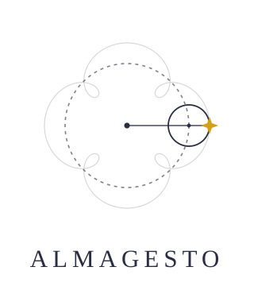
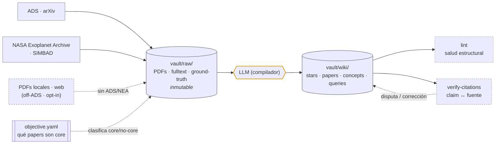
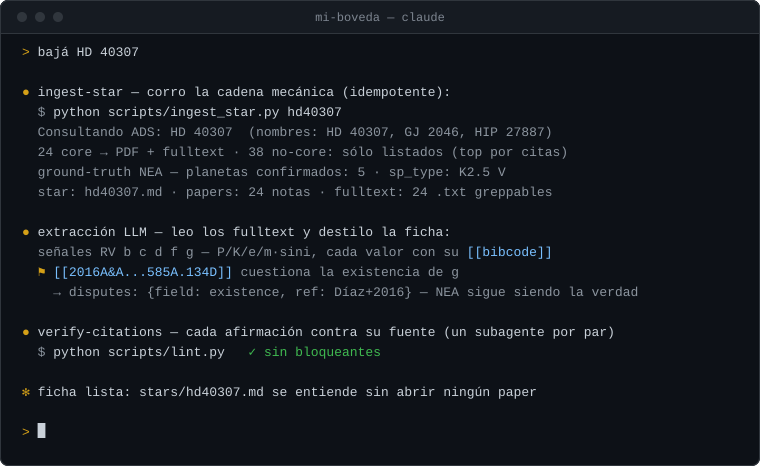
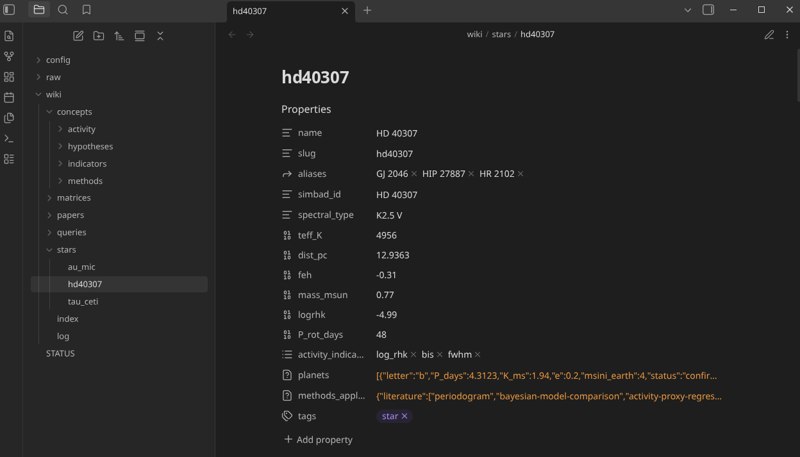
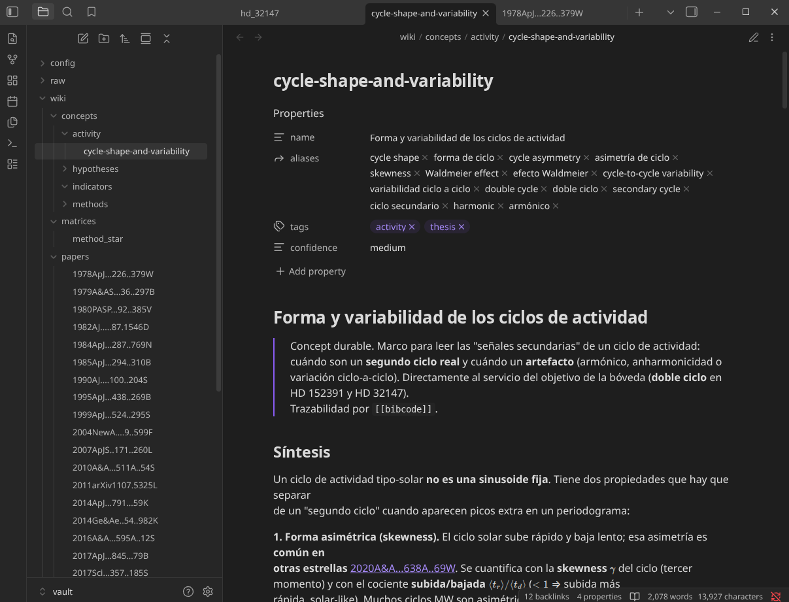
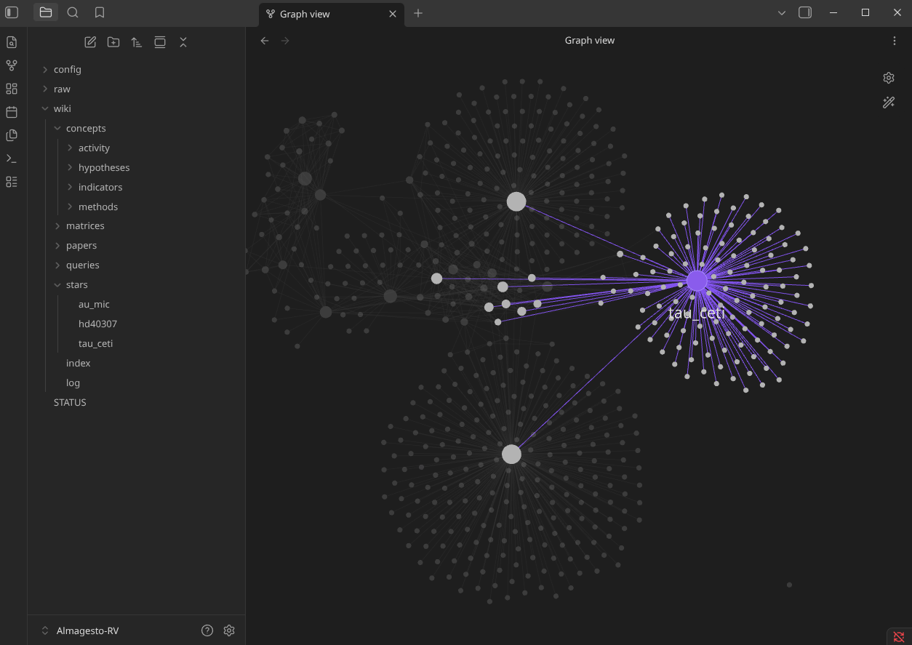

<p align="center">
  
</p>

# Almagesto: template de wiki de conocimiento astro (patrón LLM Wiki)

[](https://github.com/nicklessagus/Almagesto/actions/workflows/ci.yml)
[](https://github.com/nicklessagus/Almagesto/tags)
[](LICENSE)
[](https://github.com/nicklessagus/Almagesto/generate)

Base de conocimiento mantenida por un LLM (patrón [LLM Wiki](vault/raw/refs/karpathy-llm-wiki.md) de
Karpathy) sobre **literatura astronómica**, organizada por **estrella** y por **concepto**. Reúne todo
lo publicado relevante (planetas, actividad, indicadores, métodos), en formato a la vez **legible**
(notas + grafo Obsidian + síntesis de huecos) y **máquina-legible** (frontmatter YAML que puede
consumir un agente o humano para armar código, un informe o un paper, siempre arrastrando las citas
`[[bibcode]]` correspondientes).

Es un **template**: el objetivo de cada bóveda (de qué trata, **qué papers son "core"**) se setea en
un solo archivo, `vault/config/objective.yaml`. El resto del repo es framework reusable:
**`vault/raw/`** (fuentes inmutables: PDFs, fulltext, ground-truth de NASA Exoplanet Archive) →
**LLM** (compilador) → **`vault/wiki/`** (fichas que el LLM escribe y mantiene), con un `lint` de
salud estructural y una capa de **verificación claim↔fuente**. El schema con el que opera el agente
está en [`CLAUDE.md`](CLAUDE.md).


```mermaid
flowchart LR
    ADS["ADS · arXiv"]
    NEA["NASA Exoplanet Archive<br/>· SIMBAD"]
    OFF["PDFs locales · web<br/>(off-ADS · opt-in)"]
    OBJ[["objective.yaml<br/>qué papers son core"]]
    RAW[("vault/raw/<br/>PDFs · fulltext · ground-truth<br/><i>inmutable</i>")]
    LLM{{"LLM (compilador)"}}
    WIKI[("vault/wiki/<br/>stars · papers · concepts · queries")]
    LINT["lint<br/>salud estructural"]
    VER["verify-citations<br/>claim ↔ fuente"]

    ADS --> RAW
    NEA --> RAW
    OFF -. sin ADS/NEA .-> RAW
    OBJ -. clasifica core/no-core .-> RAW
    RAW --> LLM
    LLM --> WIKI
    WIKI --> LINT
    WIKI --> VER
    VER -. disputa / corrección .-> WIKI

    classDef src stroke:#7d8590,stroke-width:1px;
    classDef off stroke:#7d8590,stroke-width:1px,stroke-dasharray:4 3;
    classDef store stroke:#7d8590,stroke-width:1.5px;
    classDef llm stroke:#d4a017,stroke-width:2px;
    classDef check stroke:#7d8590,stroke-width:1px,stroke-dasharray:3 3;
    class ADS,NEA src;
    class OFF off;
    class RAW,WIKI store;
    class LLM llm;
    class LINT,VER check;
```

> Por defecto la bibliografía entra por **ADS**, la plomería con **descubrimiento automático**
> (query → clasificar → bajar). El **modo off-ADS** (opt-in, sólo a pedido) suma los **métodos de
> otras disciplinas** que el trabajo astro usa (análisis de datos, estadística, machine learning,
> procesos gaussianos, signal processing) cuya bibliografía canónica vive **fuera de ADS** (el eje
> tema/concepto y la capa de calidad son agnósticos de disciplina, así que la cadena los soporta
> igual): las fuentes se **declaran** (no se descubren por query) en `themes.yaml` con `source: web
> \| local-pdfs` + su lista `sources:` y entran a `vault/raw/` desde snapshots web + PDFs locales,
> sin ADS/NEA. Sigue rigiendo la **frontera dura**: sólo bibliografía citable, o sea el método
> **publicado** y no su implementación.

## Instanciar (crear tu bóveda)

**Recomendado, botón "Use this template":** en la [página del repo](https://github.com/nicklessagus/Almagesto)
apretá **"Use this template" → Create a new repository**. GitHub te crea un repo **propio** con esta
estructura e historia limpia. Después cloná *tu* repo nuevo y configurálo:

```bash
git clone git@github.com:TU_USUARIO/mi-boveda.git && cd mi-boveda
git config core.hooksPath scripts/hooks     # (opcional) pre-commit que corre el lint
git lfs install                             # PDFs por git-lfs
git config merge.ours.driver true           # protege tus archivos de instancia en futuros merges
git remote add upstream https://github.com/nicklessagus/Almagesto.git  # de acá traés mejoras del framework
pip install -r requirements.txt
echo "TU_TOKEN" > vault/config/ads_dev_key  # token ADS (gratis, gitignored)
```

> Dependencias del sistema (`pdftotext`, git-lfs; opcionales OCR y curl), la alternativa por `git
> clone` directo y el detalle por OS: ver [`docs/operacion.md`](docs/operacion.md). El token ADS es
> gratis en <https://ui.adsabs.harvard.edu/user/settings/token>.

Después **definí el objetivo pidiéndoselo al agente**: no hace falta escribir YAML ni regex a mano. El
skill `setup` traduce tu foco (en palabras) a `relevance.facets` (los buckets que deciden qué paper es
*core*), lo **prueba contra ADS** y te muestra el corte para que lo apruebes:

> **Vos:** *"configurá la bóveda: quiero separar actividad estelar de señales planetarias en RV."*
>
> **Agente (skill `setup`):** arma los buckets (`rv`, `activity`, `method`…) y corre el preview
> (`query_ads.py --probe`, no baja nada):
> ```
>   50 papers · 41 CORE · 9 no-core
>   regla de combinación vigente: OR (≥1 faceta cualquiera) → 41 CORE.
>   Si declararas una faceta-eje obligatoria (relevance.require) el corte sería:
>     require: [rv]            →    41 CORE  (−0%)
>     require: [activity]      →     9 CORE  (−78%)
>
>   CORE (todos, por citas)  [tópicos que matchearon]:
>   [CORE]   812  Stellar activity and radial-velocity jitter in...  «rv,activity»
>   [CORE]   333  Gaussian-process modelling to disentangle planets...  «rv,activity,method»
>
>   no-core (top 9 de 9, chequeo de sanidad):
>   [—   ]   210  A catalogue of nearby M dwarfs  «(ninguno)»
> ```
> Afina la regex e itera hasta que el corte cierre → te deja `vault/config/objective.yaml` listo.

Con el objetivo definido, sumás estrellas/temas y los ingestás, también pidiéndoselo al agente:
*"bajá HD 152391"* (`ingest-star`) o *"investigá BSS sobre RV"* (`ingest-theme`).

## De un objetivo a una ficha (qué hace un ingest)

Cuando le pedís ingestar una estrella o un tema, el agente:

1. **Busca en ADS** (por estrella: nombre + alias; por tema: keywords) y **clasifica** cada paper con tu
   `relevance.facets`: por default **core** = matchea ≥1 faceta y no es ruido; el resto queda
   **no-core**. Si esa regla deja entrar demasiado, se puede exigir facetas **obligatorias**
   (`relevance.require`) o un mínimo de facetas (`relevance.min_facets`); las configura el skill
   `setup` y el preview muestra cuánto cambiaría el corte.
2. Los **core** se bajan (PDF + fulltext) y el LLM los **lee y destila** en la ficha: métodos, P/K/e,
   indicadores y por qué es relevante, cada dato con su cita `[[bibcode]]` (trazable hasta el PDF).
   Antes de escribir la prosa hay un paso de **contraste**: donde los papers no coinciden, la ficha
   lleva una tabla con qué dice cada uno y con qué método. Esa tabla **no tiene columna de "valor
   adoptado"**: la bóveda reporta el estado de la literatura, no elige por vos.
3. Los **no-core** no se bajan: quedan sólo listados (top por citas, con link a ADS) en un apéndice
   *"excluidos, por las dudas"*, por si alguno debería haber entrado.

El resultado es una **ficha autosuficiente** (resumen + contraste + tablas auto + huecos) que se
entiende **sin abrir ningún paper**, con todo lo que afirma trazable a su fuente. Esa prosa la escribe un modelo: qué
partes del sistema son deterministas, cuáles no, y cómo revisar las que no, está en
[La capa LLM](#la-capa-llm).

Cada ingest por ADS deja además un **registro versionado** en `vault/config/registro/<slug>.yaml`,
que se commitea y viaja con la bóveda:

- **`busquedas`** (lista, una entrada por corrida): la query efectiva, la fecha, el límite pedido
  y los conteos (encontrados en ADS →
  traídos → core → sin juzgar → descartados). Es lo que permite saber **sobre qué universo de papers
  afirma una ficha** y con qué **lente** se filtró: el registro guarda también las facetas de
  `relevance.facets` con sus regex y la regla de combinación vigente, porque cambiar una regex mueve
  el corte core/no-core sin mover la versión del framework. La cabecera de la ficha lleva una línea
  con el resumen y el puntero al archivo.
- **`decisiones`**: el juicio de curación, o sea qué descartaste y **por qué**. Cubre los dos
  carriles: el candidato del citation chaining que no era pertinente, y la fuente declarada de un
  tema off-ADS que miraste y decidiste que no es core. Es la parte cara y no regenerable de un
  ingest (los `.json` de ADS se vuelven a pedir; tu criterio, no), así que viaja en git como ya lo
  hacían los aceptados.

Un tema **off-ADS puro** no lleva `busquedas`: no hubo query que registrar, porque sus fuentes ya
están declaradas una por una en `themes.yaml`. Uno **mixto** (fuentes declaradas + `extra_core:` con
bibcodes de ADS) sí lo lleva, con `query: null`: registra lo que entró por la vía ADS.

<p align="center">
  
</p>

## La bóveda en Obsidian

La wiki resultante es una bóveda [Obsidian](https://obsidian.md) común: se abre apuntando a
`vault/`. Las capturas de abajo son de dos instancias del template (una sobre RV, otra sobre ciclos
de actividad).

**La ficha de estrella.** Arriba, el frontmatter: el **contrato máquina-legible** que consume un
agente o un script (`teff_K`, `P_rot_days`, `planets[]` con P/K/e/m·sini, `methods_applied`; cuando
dos fuentes discrepan sobre un eje se suma `disputes`, con una posición por fuente). Abajo, fuera de
cuadro, la prosa destilada de los papers y los **tres** roll-ups que el ingest materializa
(`## Papers`, `## Planetas` y `## Métodos aplicados`): son tablas estampadas, no bloques Dataview —
un agente que abre el `.md` tiene que ver los **resultados**, no el código de una query cuyo plugin
ni siquiera está versionado.
La captura es de una instancia de julio: el schema creció desde entonces (ver el backlog de capturas
en `vault/STATUS.md`).

<p align="center">
  
</p>

**La ficha de concepto.** El otro eje de la wiki. Los `aliases` (EN + ES) hacen que el tema se
encuentre por `grep` desde cualquier término, y cada afirmación de la síntesis arrastra su
`[[bibcode]]`, la referencia que viaja con el dato cuando lo usás en un paper o en código.

<p align="center">
  
</p>

**El grafo.** Cada estrella o concepto queda en el centro de su corona de papers, y los nodos que
comparten fuentes se enlazan entre sí: así se ve de un vistazo qué está bien cubierto y qué no.

<p align="center">
  
</p>

## Skills del agente (`.claude/skills/`)

Las operaciones del patrón están empaquetadas como skills invocables (Claude las dispara solo por la
descripción, o el usuario con `/<nombre>`). Encapsulan la cadena mecánica + el criterio LLM:

| Skill | Cuándo | Qué hace |
|---|---|---|
| `setup` | "configurá la bóveda", "definí el objetivo" | Paso 0: traduce tu foco en palabras a `objective.yaml` (incluida la regex `relevance.facets`) y la **afina contra ADS con un preview** (`query_ads --probe`), para que NO escribas regex a mano. No ingesta. |
| `ingest-star` | "bajá/ingestá/agregá la estrella X" | Corre la cadena mecánica (orquestador `ingest_star.py`) y hace la extracción LLM de los papers clave + síntesis + bookkeeping. Incluye la **compuerta de triage** del citation chaining: el candidato que sólo *menciona* al sujeto no se baja sin juicio (`triage.py`). |
| `ingest-theme` | "investigá a fondo el tema X" | Como ingest-star pero por TEMA: query ADS por keywords → concept durable en `concepts/`. Soporta temas off-ADS (opt-in) vía `source: web\|local-pdfs` + `sources:` en `themes.yaml`. |
| `append-knowledge` | "agregale este paper a la ficha X", "sumá este PDF al concept Y" | Pliega **una fuente puntual** (bibcode / PDF / URL) a una ficha/concepto **existente**: plomería mínima + extracción enfocada + síntesis a la nota viva. No crea entidades ni barre por query. |
| `test-hypothesis` | "hipótesis: …", "evidencia a favor/contra de …" | Testea un supuesto **durable** contra el fulltext y responde con veredicto citado; **a pedido del usuario** lo archiva en `concepts/hypotheses/` y taggea papers (`thesis_links`/`bearing`). |
| `query-corpus` | búsqueda/pregunta general (no hipótesis) | Responde contra índice + frontmatter + fulltext; archiva en `vault/wiki/queries/` **sólo si el usuario lo pide**. |
| `verify-citations` | cierre de toda operación con prosa `[[bibcode]]` | Chequea, afirmación por afirmación, que la fuente respalde el claim (1 subagente/par lee el fulltext). |
| `find-contradictions` | "buscá contradicciones", "¿qué papers discrepan sobre X?" | Barre un eje (estrella/parámetro o concepto) y confirma desacuerdos claim↔claim **entre** papers → propone `disputes` (con una posición por fuente, y un marcador propio cuando quien arbitra es la NASA) para que apruebes. |
| `maintain` | "actualizá X", "borrá el paper Y", "renombrá el slug", "re-clasificá" | Mantiene entidades **ya ingestadas**: refrescar con papers nuevos, borrar/renombrar limpio, re-clasificar tras cambiar `relevance.facets`, resolver backlog del lint. |

## Verify: todo claim tiene fuente

El diferencial sobre el patrón base: el lint de Karpathy chequea salud estructural, no que la fuente
**respalde** la afirmación. Acá toda afirmación va citada `[[bibcode]]` o marcada `inferencia`, y el
skill `verify-citations` la contrasta contra el texto real del paper (un subagente por par, con cita
textual obligatoria; una contradicción se convierte en disputa tagueada, no en cita rota). Las filas
de tabla heredan la cita del ámbito que las introduce (si no, se caerían del chequeo), y en las
transcripciones se pregunta además por lo que la nota **omite**: una tabla truncada no afirma nada
falso, pero se lee como completa. La tasa de
error del verificador se mide con un auto-benchmark que siembra citas falsas y las juzga a ciegas.

## Dónde encaja (related work)

El patrón LLM Wiki ya tiene implementaciones genéricas, y la IA-para-literatura es un mercado con
productos grandes. La distinción de fondo: casi todos producen una **respuesta efímera** (un chat, un
informe generado al momento de la consulta) sobre un índice remoto que no controlás; Almagesto
produce un **artefacto persistente**: una bóveda versionada en git, con corpus propio a fulltext,
donde cada afirmación arrastra su `[[bibcode]]` y una capa de verificación la contrasta con el paper.

| Herramienta | Qué es | Diferencia con Almagesto |
|---|---|---|
| [pathfinder](https://iopscience.iop.org/article/10.3847/1538-4365/ad7c43) | búsqueda semántica en lenguaje natural sobre ~385k papers de ADS | **el vecino astro, complementario y no rival**: pathfinder *encuentra* papers; Almagesto los *cura, destila y verifica* a fulltext. Flujo natural: pathfinder encuentra → `ingest` acá |
| [karpathy-llm-wiki](https://github.com/Astro-Han/karpathy-llm-wiki) y otras implementaciones genéricas del patrón | ingest/query/lint de propósito general | sin plomería de fuentes (ADS/arXiv/NEA), sin ground-truth duro, sin verificación claim↔fuente (la implementación más popular descarta a propósito las citas con nº de línea, que acá son obligatorias) |
| [Elicit](https://elicit.com) · [SciSpace](https://scispace.com) · [Consensus](https://consensus.app) · [Scite](https://scite.ai) · [Undermind](https://undermind.ai) | asistentes comerciales de literature review (índices de 100–280M papers) | informe efímero en query-time sobre un índice remoto, cerrado y pago; no queda corpus propio ni artefacto curado que componga entre sesiones |
| [PaperQA2](https://github.com/Future-House/paper-qa) (FutureHouse) | agente open-source de QA científica, SOTA en benchmarks de literatura | responde preguntas sueltas; no mantiene una base curada y versionada, así que el conocimiento no se acumula entre sesiones |
| [NotebookLM](https://notebooklm.google) · [Khoj](https://github.com/khoj-ai/khoj) · Obsidian+Zotero | RAG / "second brain" sobre tus documentos | RAG sobre lo que ya tenés: sin regla de admisión (qué paper entra y por qué, `relevance.facets`), sin ground-truth, sin verificación afirmación por afirmación |

Nota sobre la capa de verificación: las herramientas de chequeo de citas (p. ej.
[CiteCheck](https://arxiv.org/abs/2605.27700)) validan que la referencia **exista** y que su metadata
sea fiel, no que el paper **respalde** la afirmación. Esa alineación claim↔cita es justamente el
punto de `verify-citations` (sección anterior).

## La capa LLM

Contrario a lo que parecería indicar el "hype de la IA", los modelos de lenguaje pueden, y van a,
cometer errores. Se trató de que las partes del template que usan un modelo de lenguaje sean
solamente las necesarias y donde estas herramientas realmente pueden aportar un diferencial, se hizo
todo lo posible para mitigar sus problemas conocidos, así y todo siempre se recomienda una revisión
por una persona humana con criterio, sin límite de tokens y con su propio sesgo.

La división de fondo es la del patrón: **los scripts bajan y chequean, el modelo lee y destila.**
Todo lo que puede ser determinista lo es, y lo que no, queda marcado como tal en la propia bóveda.

### Quién decide cada cosa

| Etapa | Quién |
|---|---|
| Definir la lente (qué paper es "core") | **El modelo propone, vos aprobás**: traduce tu foco a una regla y el preview te muestra el corte real antes de guardar nada |
| Buscar en ADS y clasificar core / no-core | **Determinista**: la misma regla aplicada igual a todos |
| Bajar PDFs y extraer el texto | **Determinista** (`pdftotext`; OCR sólo si la capa de texto es ilegible, y queda marcado) |
| Parámetros de la estrella y de sus planetas | **Determinista**: NASA Exoplanet Archive + SIMBAD. El modelo **no** los escribe |
| Juzgar los candidatos del citation chaining | **El modelo**, con los dudosos derivados a vos |
| Extraer de cada paper qué método usa y qué aporta | **El modelo** |
| Escribir la síntesis de fichas y conceptos | **El modelo** |
| Verificar que cada cita respalde su afirmación | **El modelo**, con un subagente independiente por afirmación |
| Detectar contradicciones entre papers | **El modelo propone, vos aprobás** antes de que se escriba nada |
| Retracciones y correcciones publicadas | **Determinista**: Crossref por DOI |
| Salud estructural (lint) y registro de qué se buscó | **Determinista** |

### Cómo se acota cada parte que hace el modelo, y cómo la chequeás

**Definir la lente.** El agente no la aplica a ciegas: el preview corre la regla candidata contra ADS
y muestra el corte con títulos reales, más cuánto cambiaría si exigieras facetas obligatorias.
*Chequeo humano:* mirás esa lista. Si un paper que conocés cae del lado equivocado, la regla está
mal, no el paper. Además el registro de cada ingest guarda la lente exacta con la que se clasificó.

**Juzgar los candidatos del chaining.** El grafo de citas trae muchos papers que apenas mencionan al
sujeto sin hablar de él, así que nada del grafo entra automáticamente salvo que el sujeto esté en el
**título**. El resto **no se baja** hasta que alguien lo juzgue, cada descarte queda con su motivo y
su fecha en config versionada, y los dudosos van a vos.
*Chequeo humano:* el triage deja una tabla con título, año, citas y link a ADS de todo lo pendiente,
y el registro te dice después qué se descartó y por qué.

**Extraer datos de un paper.** El modelo lee el texto completo, no su memoria. Los valores duros
(período, semiamplitud, excentricidad, masa) **no** los escribe el modelo: vienen del ground truth, y
cuando un paper discrepa se marca como disputa en vez de sobreescribir. El lint recalcula la masa
implícita a partir de K, P, e y la masa estelar, y marca las inconsistencias.
*Chequeo humano:* cada dato lleva su `[[bibcode]]` y el `.txt` de esa fuente está versionado en el
repo, así que verificarlo es un `grep` de la frase. El frontmatter es auditable contra el archivo de
la NASA, y el lint lo compara **campo por campo**: vale lo que dice el ground truth o queda vacío.
Que la NASA no tenga un valor es lo normal (la semiamplitud y la excentricidad faltan seguido), y ese
hueco **no se rellena** con lo que dice un paper — ese número va a la prosa, con su cita. Si no,
quedaría con el mismo aspecto que el auditable.

**Escribir la síntesis.** Toda afirmación va citada o marcada explícitamente como inferencia, cada
ficha y concepto que genera el template abre avisando que esa prosa es capa LLM, y el lint lista los
conceptos que no citan ninguna fuente.
*Chequeo humano:* leerla con los `.txt` al lado. Cada cambio es un diff de git, así que se revisa
como se revisa código.

**Verificar las citas.** Acá hay un modelo chequeando a otro modelo, y eso tiene un techo: es juicio
robusto, no prueba. Lo que se hizo para acotarlo: cada afirmación la juzga un subagente
**independiente** que lee **solamente** el texto de esa fuente y tiene prohibido responder de
memoria; está obligado a devolver **cita textual y número de línea**, y sin eso la afirmación cuenta
como no soportada; los veredictos distinguen "la fuente no lo dice" de "la fuente dice lo
contrario", que son problemas distintos; y en tablas y listas se chequea además lo que la nota
**omite**, porque una transcripción sin errores pero incompleta se lee como completa. Además el
verificador **se puede medir**: el template incluye un benchmark que siembra citas falsas por
construcción entre las reales de tu propia bóveda y calcula, a ciegas, qué fracción caza. El número
que da es el de **tu** bóveda: depende de tu corpus, de tu modelo y de cómo estén escritas tus notas.
*Chequeo humano:* el bloque `## Verificación de citas` queda fechado en la nota, y el lint avisa
cuando la nota se editó después de esa fecha, o sea cuando hay prosa que nunca pasó por el chequeo.

**Detectar contradicciones.** Cada desacuerdo lo confirma un subagente que lee **los dos** textos y
tiene que citar de ambos lados, y nada se escribe sin que vos lo apruebes.
*Chequeo humano:* la propuesta viene con las dos citas; si una no dice lo que se afirma, se cae sola.

### El límite

Nada de esto vuelve infalible a la bóveda. Un modelo puede leer bien y resumir mal, puede afirmar de
menos (omitir sin mentir, que es el modo de falla más difícil de ver) y puede sonar igual de seguro
en los dos casos. Lo que el diseño intenta garantizar es algo más modesto y más verificable: que
**todo lo que la wiki afirma tenga una fuente citable al lado**, que esa fuente esté en el repo para
que la puedas abrir, y que quede registrado qué se buscó, con qué filtro y qué se decidió descartar.
El juicio final sobre lo que importa sigue siendo tuyo, y para lo que vayas a publicar conviene
seguir leyendo los papers centrales de tu tema.

## Para seguir

- **Operación día a día**: dependencias completas, layout del repo, scripts sueltos, traer mejoras
  del framework (`upstream`/`merge=ours`), portabilidad entre máquinas, Obsidian:
  [`docs/operacion.md`](docs/operacion.md)
- **Schema del agente** (frontmatter, reglas, operaciones): [`CLAUDE.md`](CLAUDE.md) · estado en
  `vault/STATUS.md` · catálogo en `vault/wiki/index.md`
- **Tests del framework** (suite determinista, corre en CI): [`tests/README.md`](tests/README.md)
- **Diseño**: [gist de Karpathy](vault/raw/refs/karpathy-llm-wiki.md) ·
  [guía de implementación](vault/raw/refs/starmorph-implementation-guide.md)

## Licencia

MIT. Ver [`LICENSE`](LICENSE).
