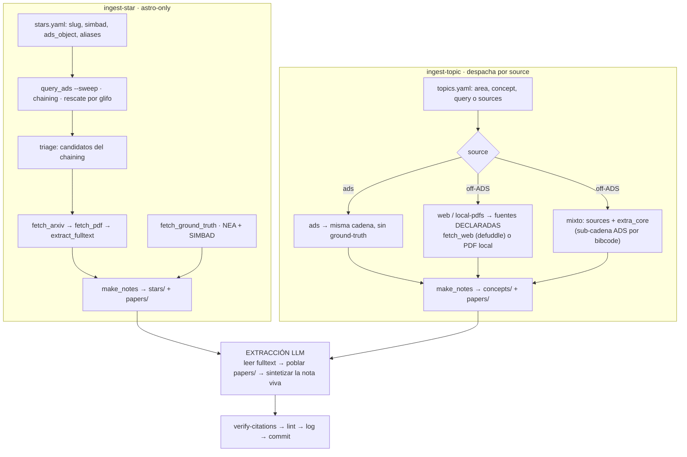
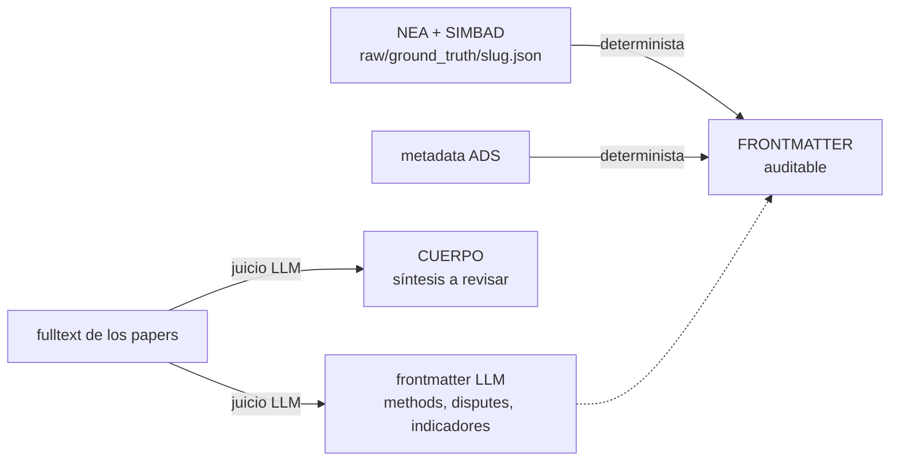

# Las dos ingestas y qué llena la ficha — referencia

> Complementa `docs/operacion.md` (que lista **los scripts** y sus flags) y `CLAUDE.md` (que define
> **el schema**). Acá va lo que ninguno de los dos muestra junto: **el embudo de selección** —de
> cuántos papers se parte y cuántos llegan a la ficha—, **las dos ingestas lado a lado**, y **campo
> por campo quién llena la ficha y de dónde sale cada cosa**.
>
> Describe el estado **vigente**. Lo propuesto y no implementado va al final, en *Backlog abierto*.

## 1. El embudo

Un ingest no procesa todo lo que ADS devuelve. Se angosta en cinco escalones, y sólo uno de ellos
es visible en el stdout de la corrida:

```
n_found  (lo que ADS dice que hay)
  └─ rows=2000, sort citation_count desc   ← el corte por citas: SÓLO si n_found > rows
     + 2ª pasada, sort date desc           ← sólo si truncó: rescata la cola reciente (#79)
      └─ classify(): core / no-core        ← regex relevance.topics sobre título+abstract+keywords
         └─ SÓLO los core se bajan         ← fetch_arxiv.main · make_notes.write_paper_notes
            └─ candidatos del chaining     ← no se bajan hasta que los juzgues (triage)
               └─ los que el PDF falló     ← build/<slug>/missing_pdf.json → sin fulltext
                  └─ "papers clave"        ← la extracción LLM (criterio no definido, #62)
                     └─ ejes en disputa    ← el contraste cross-paper (#72)
                        └─ lo que llegó a la ficha  ← la síntesis (red: #75)
```

Los **no-core no se bajan ni se extraen**: quedan como puntero en el apéndice *Excluidos por el
filtro* de la nota (top por citas, con link a ADS). La extracción corre sobre **los core con
fulltext**, no sobre todo el universo.

### Quién decide qué, y con qué

| Escalón | Decide | Criterio | ¿Usa citas? |
|---|---|---|---|
| Query | `build_query` / query cruda | nombre+alias sobre `title:`/`abs:` | no |
| Corte de `rows` | ADS | `sort: citation_count desc` + 2ª pasada `date desc` | **sí** (sólo al truncar) |
| Core / no-core | `classify()` | regex `relevance.topics` + doctype + `require`/`min_topics` | no |
| Recall extra | chaining, glifo, `--sweep` | grafo de citas anclado al sujeto; full-text | ranking del sweep: **sí** |
| Triage | **vos / el LLM** | título+abstract, pertinencia al sujeto | no |
| Extracción | **el LLM** | "papers clave" — sin definir | no |

Las dos decisiones que importan —qué es core y qué es pertinente— son **ciegas a las citas**. Éstas
sólo ordenan. El chaining corre en **las dos direcciones** (`references()` hacia atrás,
`citations()` hacia adelante), así que un paper reciente que cite a un core entra por el grafo sin
necesitar citas propias.

Donde el orden **sí** decide qué entra es al **truncar**: el `sort` viaja en la request a ADS, y un
corte por citas se queda con lo viejo (las citas se acumulan con la edad). Por eso, si la query
directa trunca, se corre una **segunda pasada con la misma query ordenada por fecha** (#79): lo que
la primera no trajo entra con `via: query:recent`, antes del chaining, así que además siembra el
grafo. El corpus sigue **truncado** —falta el medio— y la marca lo dice con cuántos rescató. Los
órdenes de las listas que se **muestran** (el ranking del `--sweep`) usan **citas/año**, política
única en `lib_config.sort_by_citation_rate`.

### Los dos mundos de fulltext

ADS indexa el **texto completo** de los papers, no sólo el abstract: el campo `full:` busca *adentro*
del paper. Eso es lo que permite encontrar una estrella que aparece **sólo en una tabla** — si la
tabla es texto, es parte del texto indexado. **La búsqueda la hace ADS, no nosotros.**

| | Dónde vive | Para qué | Cuándo |
|---|---|---|---|
| Índice `full:` de ADS | servidor de ADS | **descubrir** qué papers mencionan al sujeto | **antes** de bajar nada |
| `raw/fulltext/<slug>/*.txt` | tu disco | **leer y grepear** — extracción, `verify-citations`, retro-tag | **después** de bajar el PDF |

Corolario práctico: el corpus local sólo tiene los core bajados, así que **un `grep` local nunca va a
encontrar un paper que ADS no trajo**. Para eso está el `--sweep`, que le pregunta al índice grande.

Qué usa cada camino:

| Camino | Campo | Alcanza tablas |
|---|---|---|
| Query directa | `title:` + `abs:` | **no** |
| Chaining (`references()`/`citations()`) | `full:` como ancla al sujeto | sí, si el paper está en el grafo de citas |
| `--sweep` (paso 2b, **manual**) | `full:` con todas las variantes de grafía | sí, también fuera del grafo |
| Rescate por glifo | superset de la constelación + filtro client-side | — |

⚠ **Cuándo falla igual:** si la tabla es una **imagen** (papers viejos escaneados) no hay texto que
indexar, y si el OCR del escaneo se comió la fila tampoco. Medido: el OCR de ADS perdió **12 de 26**
estrellas en Saar & Brandenburg 1999. Por eso un `full:` que devuelve **0 es inconcluso, no
ausencia** → abrir el PDF/tabla, corroborar por papers que lo citan, o meterlo a mano con
`extra_core`.

### Rescate por glifo

Los nombres **Bayer** (letra griega + constelación) se escriben con varios caracteres Unicode que se
ven iguales, y ADS **no los trata igual**: unifica `ε` (U+03B5) con `epsilon`/`eps`, pero el
tokenizer **descarta** los lookalikes `ϵ` (U+03F5) y `∊` (U+220A — el glifo de ApJ/AJ/MNRAS). Un
paper titulado *"…Orbiting ∊ Eridani"* queda indexado sólo como "Eridani": `title:"epsilon Eridani"`
**no lo matchea nunca**. Medido en ε Eri: **121 core perdidos**, incluido el descubrimiento.

Agregar grafías a `aliases` no sirve —el carácter se descarta, no falta la variante—, así que el
rescate trae el **superset de la constelación** y filtra client-side por el glifo. Corre solo, sólo
para letras con lookalikes conocidos, y marca los papers `via: glyph`.

## 2. Las dos ingestas



Diferencias que importan:

| | **ingest-star** | **ingest-topic** |
|---|---|---|
| Sujeto | una estrella | un tema o método |
| Fuente | ADS siempre (astro-only) | ADS **o** fuentes declaradas (off-ADS, opt-in) |
| Ground-truth | **sí** — NEA + SIMBAD | **no existe** |
| Descubrimiento | query + chaining + glifo + sweep | query + chaining (ads) · **ninguno** (off-ADS) |
| Clave de cita | bibcode ADS | bibcode, o sintética `AAAA+Autor` |
| Destino | `wiki/stars/<slug>.md` | `wiki/concepts/<area>/<concept>.md` |
| Retro-linkeo | seeds `stars` add-only | seeds `thesis_links` + retro-tag por grep de aliases |
| Matriz método×estrella | se toca | **no** se toca |

El **modo off-ADS** existe para métodos de otras disciplinas (estadística, ML) al servicio del foco
astro, cuya bibliografía canónica vive fuera de ADS. Su costo: **sin query no hay descubrimiento**,
las fuentes se declaran una por una — y por eso la sección `busqueda` del registro versionado queda
vacía (#77).

## 3. Qué se llena en la ficha de estrella

Tres capas con **estatus epistémico distinto**, y el disclaimer de cabecera existe para separarlas:



| Dónde | Campo / sección | Lo llena | Sale de |
|---|---|---|---|
| frontmatter | `name`, `slug`, `aliases`, `simbad_id` | script | `stars.yaml` + SIMBAD |
| frontmatter | `spectral_type`, `teff_K`, `dist_pc` | script | SIMBAD / NEA |
| frontmatter | `P_rot_days` | script (NEA `st_rotp`) | **espejo puro**: si NEA no lo tiene queda null; el valor de literatura va al cuerpo, citado |
| frontmatter | `planets[]` (`letter`, `P_days`, `K_ms`, `e`, `mass_earth`, `status`) | script | **NEA — ground-truth** (espejo puro: `K_ms`/`e` faltan seguido y el null se respeta) |
| frontmatter | `disputes[]` (nivel nota) | **LLM** | desacuerdo sobre un eje, con **una posición por fuente**: `{ref, value}` por paper y `{source: ground_truth, value}` si NEA arbitra |
| frontmatter | `activity_indicators_expected` | **LLM** | extracción de los papers |
| frontmatter | `methods_applied.literature` | **LLM** | `methods` de los papers de la estrella |
| frontmatter | `methods_applied.ours`, `data_local` | usuario | rutas locales (no se commitean) |
| frontmatter | `generator`, `tags`, `confidence` | script | provenance |
| cabecera | disclaimer ⚠ + línea de búsqueda (fecha, universo→core, pendientes) | script | `registro/<slug>.yaml` |
| cuerpo | `## Inventario por eje` | **LLM** | el paso de **contraste**: qué dice cada paper sobre cada eje en disputa (sin columna "valor adoptado") |
| cuerpo | `## Resumen` | **LLM** | síntesis de los papers, apoyada en el inventario, con `[[bibcode]]` |
| cuerpo | `## Huecos` | **LLM** | qué falta para que la ficha alcance sola |
| cuerpo | `## Planetas` | script (Dataview) | render del frontmatter |
| cuerpo | `## Papers`, `## Métodos aplicados` | script (Dataview) | roll-up — ⚠ no resuelve sin Obsidian (#60) |
| cuerpo | `## Excluidos por el filtro` | script | snapshot de los no-core, top por citas |
| cuerpo | `## Verificación de citas` | **LLM** | salida de `verify-citations`, **con fecha** |

En la nota de **concepto** la tabla es más corta porque **no hay ground-truth**: frontmatter
`name` / `aliases` / `tags` / `confidence`, y todo lo demás (`## Síntesis`, `## Inventario por eje`,
`## Régimen de validez`, `## Huecos`) es síntesis LLM citada. La sección propia del concepto es el
**régimen** (#74): acá dos papers pueden decir cosas distintas y **estar los dos bien** porque valen
bajo condiciones distintas, así que el modo de falla no es "no coinciden" sino **generalizar de
más** — y ése `verify-citations` lo devolvía `soportada`, porque la afirmación pelada sí está en el
paper. El roll-up junta por `thesis_links` (y por `methods` si el área es `methods`).

En la nota de **paper**: la metadata (bibcode, autores, año, doi, `citation_count`, `pdf`,
`fulltext`, `fulltext_source`, `pdf_source`) la estampan los scripts por **verdad de disco**; el LLM
llena `methods`, `thesis_links`, `bearing`, `role` y la sección `## Extracción`. **`bearing` vs
`role`:** el primero dice la *postura* respecto de una tesis (`supports`/`challenges`/`method`); el
segundo, **qué tipo de aporte es** — `fundacional` (introduce el método) · `aplicacion` (lo instancia
en un caso) · `arbitro` (resuelve una tensión previa). El rol es el que define **cómo se contrasta**
un paper contra otro: fundacional↔aplicación no es contraste sino instanciación, y leerlo como
desacuerdo fabrica disputas falsas (#73). Los **bullets** de esa
sección los ramifica el stub por **tipo de sujeto**: para una estrella, el ground-truth (P/K/e por
planeta) más los **ejes de `relevance.topics`** —o sea la lente de *tu* bóveda, no una lista fija—;
para un tema, *aporte al tema* y *régimen de validez*, sin planetas ni actividad. Las dos ramas de
tema (ADS y off-ADS) escriben el mismo bloque.

## 4. Las reglas que gobiernan qué entra

- **Frontera dura (#0).** Todo lo que entra a `vault/wiki/` sale de una fuente citable o es
  conclusión derivada de fuentes citadas. Nada de parámetros de pipeline, nombres de variables ni
  decisiones de implementación.
- **Regla de poda.** Un hecho de un paper tangencial entra a la prosa de la ficha **sólo si cambia
  cómo se lee una señal RV**; el resto vive en su nota de paper.
- **Disputas.** Cuando NEA arbitra sigue siendo el valor de verdad: el paper que discrepa se
  **taguea**, no se sobreescribe. Pero la estructura no asume que haya árbitro: cada disputa lista
  **una posición por fuente**, y `{source: ground_truth}` es lo que distingue "hay autoridad" de "la
  bóveda no sabe" (#71). Eso es lo que permite expresar un desacuerdo **paper↔paper** —el caso normal
  cuando NEA calla— que antes terminaba en prosa suelta. Sólo discrepancias **materiales** (mayores
  que el error).
- **Espejo puro (#70).** Los campos que el script copia del ground-truth valen lo que dice NEA **o
  nada**. Un null de NEA no es un hueco a completar: rellenarlo con literatura vuelve ese número
  indistinguible del auditable, que es justo la distinción que la cabecera promete. El valor de
  literatura vive en el cuerpo, con su `[[bibcode]]`. El lint lo compara campo por campo.
- **Autosuficiencia.** La ficha tiene que alcanzar sola: si para responder algo hay que abrir un
  paper, eso falta en la ficha. Los `[[bibcode]]` son trazabilidad, no lectura obligatoria.
- **Todo lo apuntable es chequeable.** Cada afirmación fáctica va **citada** o marcada
  **`inferencia`**. Excepción: los valores de ground-truth NEA, que no se verifican contra papers.
- **La extracción tiene que llegar (#75).** Un paper con `methods` poblado ya pagó el paso más caro
  de la cadena; si su bibcode no aparece citado en ninguna ficha ni concepto, esa extracción se
  perdió. El lint lo reporta como backlog. Se cierra sintetizándolo, o declarando `no_sintetizado:
  <motivo>` en su nota cuando la regla de poda manda dejarlo fuera de la prosa.

## 5. Backlog abierto

Esta ingesta tiene huecos conocidos y numerados; el detalle de cada uno está en su issue.

| Tema | Issues |
|---|---|
| Qué papers leer (criterio de la extracción) | #62 |
| Persistir los veredictos `aparente` de find-contradictions | #63 |
| Las keywords del propio paper se piden, se usan como texto plano y se tiran | #92 |
| Descubrimiento fuera de ADS (OpenAlex) | #77 |
| Tema mixto sólo off-ADS-first | #78 |
| Sesgo de edad en el orden por citas | #79 |
| Libros: `pending` y unidad de cita | #80 |

Y los del recorrido paso a paso del embudo, por escalón:

| Escalón | Issues |
|---|---|
| 1 · resolver el sujeto | #82 (aliases desde SIMBAD, con checkpoint), #83 (`setup` no propone facetas) |
| 2 · `query_ads` | #85 (`fq` de la lente astro hardcodeado), #79 |
| 3 · `classify()` | #86 (registro sin abstract), #87 (facetas matcheadas sin usar; sacar `relevance`), #92 (las keywords del paper se apelmazan como texto y no llegan a la nota) |
| 4-5 · recall extra | #88 (el `--sweep` no deja rastro), #79 |
| 6 · triage | #89 (el aceptado sin motivo ni origen), #79 |
| 7 · PDFs y fulltext | #90 (core sin PDF no se marca en su nota), #80 |
| 13-14 · verify → lint | #91 (veredictos sin resolver bajo un encabezado que certifica) |

**Dos patrones transversales**, que valen más que los issues sueltos: (a) #86/#88/#89/#90 escriben
los cuatro al registro versionado → **una tanda de schema, no cuatro migraciones**; (b) #79 acumula
cuatro ocurrencias del mismo orden por citas (truncamiento, ranking del sweep, apéndice de excluidos,
listado del triage), y sólo la primera es server-side — **las dos primeras están hechas** (1.12.0),
quedan el apéndice y el listado del triage.
